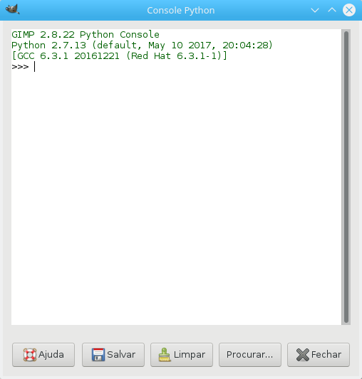

# Passo 3 - Descobrindo funções do GIMP

Este documento é parte do [tutorial de desenvolvimento de plugins gimp](../README.md).

Agora que já temos um exemplo da estrutura de um plugin, está na hora de
descobrir o que o GIMP é capaz de fazer via programação.

O GIMP organiza toda a sua funcionalidade acessível para scripts e plugins
através de um banco de dados de procedimentos. Este banco de dados é
representado pelo objeto `pdb` do módulo `gimpfu`.

A maneira mais simples de acessar informações deste banco de dados é através do
console python presente no GIMP (Menu *Filtros/Python-Fu/Console* no GIMP em
pt_BR).

O console aparece como a figura a seguir:



## Console Python no GIMP

O console python executa a instrução `from gimpfu import *` na inicialização,
fazendo com que os objetos definidos no módulo `gimpfu` estejam acessíveis no
namespace padrão. Desta forma, você pode acessar diretamente os objetos `gimp` e
`pdb` no console.

O Console executa o mesmo interpretador Python que o GIMP irá executar
normalmente. Desta forma, qualquer instrução que você pode colocar em um plugin
pode ser executada diretamente no console.

Por exemplo, ao executar no console:

~~~python
>>> gimp.progess_init("Olá Mundo")
~~~

A barra de progresso é mostrada com a mensagem "Olá Mundo".

Com isto, podemos utilizar o console para fazer pesquisas no banco de dados de
procedimentos.

# O banco de dados PDB

A chamada à função `gimpfu.register` no exemplo do [Passo 1](passo1.md) faz o
registro (inclusão) do seu plugin no banco de dados PDB, o banco de dados de
procedimentos do GIMP.

Qualquer plugin e muitas funcionalidades internas do GIMP estão registradas
neste banco de dados, e podem ser acessadas a partir dele.

A maneira mais simples de fazer buscas neste banco de dados é utilizar o método
`query` do objeto `pdb` via console:

~~~python
>>> pdb.query('load')
['file-xjt-load', 'file-png-load', 'file-faxg3-load', 'file-openraster-load-thumb', 'file-bz2-load', 'file-ico-load-thumb', 'file-pcx-load', 'file-tiff-load', 'file-cel-load', 'file-sunras-load', 'gimp-register-magic-load-handler', 'file-jpeg-load-thumb', 'file-gbr-load', 'file-svg-load', 'file-sgi-load', 'gimp-xcf-load', 'file-fits-load', 'gimp-register-load-handler', 'gimp-get-module-load-inhibit', 'file-xwd-load', 'file-pat-load', 'file-wmf-load-thumb', 'gimp-file-load-layer', 'file-xpm-load', 'file-psd-load', 'file-pdf-load', 'file-psd-load-thumb', 'file-jp2-load', 'file-ico-load', 'gimp-selection-load', 'file-psp-load', 'file-dicom-load', 'file-pnm-load', 'file-svg-load-thumb', 'gimp-file-load-layers', 'gimp-file-load', 'file-gz-load', 'file-tga-load', 'file-jpeg-load', 'file-wmf-load', 'file-xmc-load-thumb', 'file-openraster-load', 'file-gif-load-thumb', 'gimp-register-thumbnail-loader', 'file-pdf-load-thumb', 'file-eps-load', 'file-ps-load', 'file-raw-load', 'file-gih-load', 'file-xmc-load', 'file-desktop-link-load', 'file-pix-load', 'file-fli-load', 'file-ps-load-thumb', 'file-uri-load', 'file-bmp-load', 'file-ps-load-setargs', 'file-xbm-load', 'file-gif-load', 'gimp-file-load-thumbnail']
~~~

Como mostrado acima, o método `query` irá consultar o banco de dados e retornar
em uma lista todos os nomes de funções cujo nome que contém o texto passado na
consulta.

Esta lista pode ser mostrada com um pouco mais de informação com o nome da
função e uma explicação simples sobre ela:

~~~python
>>> funcoes = [ (item, pdb[item].proc_blurb) for item in pdb.query('load') ] 
>>> for item in funcoes: print item
... 
('file-xjt-load', 'loads files of the jpeg-tar file format')
('file-png-load', 'Loads files in PNG file format')
('file-faxg3-load', 'loads g3 fax files')
('file-openraster-load-thumb', 'loads a thumbnail from an OpenRaster (.ora) file')
('file-bz2-load', 'loads files compressed with bzip2')
('file-ico-load-thumb', 'Loads a preview from an Windows ICO file')
('file-pcx-load', 'Loads files in Zsoft PCX file format')
('file-tiff-load', 'loads files of the tiff file format')
('file-cel-load', 'Loads files in KISS CEL file format')
('file-sunras-load', 'load file of the SunRaster file format')
('gimp-register-magic-load-handler', 'Registers a file load handler procedure.')
('file-jpeg-load-thumb', 'Loads a thumbnail from a JPEG image')
('file-gbr-load', 'Loads GIMP brushes')
('file-svg-load', 'Loads files in the SVG file format')
('file-sgi-load', 'Loads files in SGI image file format')
('gimp-xcf-load', 'Loads file saved in the .xcf file format')
('file-fits-load', 'load file of the FITS file format')
('gimp-register-load-handler', 'Registers a file load handler procedure.')
('gimp-get-module-load-inhibit', 'Get the list of modules which should not be loaded.')
('file-xwd-load', 'Loads files in the XWD (X Window Dump) format')
('file-pat-load', "Loads Gimp's .PAT pattern files")
('file-wmf-load-thumb', 'Loads a small preview from a WMF image')
('gimp-file-load-layer', 'Loads an image file as a layer for an existing image.')
('file-xpm-load', 'Load files in XPM (X11 Pixmap) format.')
('file-psd-load', 'Loads images from the Photoshop PSD file format')
('file-pdf-load', 'Load file in PDF format')
('file-psd-load-thumb', 'Loads thumbnails from the Photoshop PSD file format')
('file-jp2-load', 'Loads JPEG 2000 images.')
('file-ico-load', 'Loads files of Windows ICO file format')
('gimp-selection-load', "Deprecated: Use 'gimp-image-select-item' instead.")
('file-psp-load', 'loads images from the Paint Shop Pro PSP file format')
('file-dicom-load', 'loads files of the dicom file format')
('file-pnm-load', 'Loads files in the PNM file format')
('file-svg-load-thumb', 'Generates a thumbnail of an SVG image')
('gimp-file-load-layers', 'Loads an image file as layers for an existing image.')
('gimp-file-load', 'Loads an image file by invoking the right load handler.')
('file-gz-load', 'loads files compressed with gzip')
('file-tga-load', 'Loads files of Targa file format')
('file-jpeg-load', 'loads files in the JPEG file format')
('file-wmf-load', 'Loads files in the WMF file format')
('file-xmc-load-thumb', "Loads only first frame of X11 Mouse Cursor's animation sequence which nominal size is the closest of thumb-size to be used as a thumbnail")
('file-openraster-load', 'load an OpenRaster (.ora) file')
('file-gif-load-thumb', 'Loads only the first frame of a GIF image, to be used as a thumbnail')
('gimp-register-thumbnail-loader', 'Associates a thumbnail loader with a file load procedure.')
('file-pdf-load-thumb', 'Loads a preview from a PDF file.')
('file-eps-load', 'load Encapsulated PostScript images')
('file-ps-load', 'load PostScript documents')
('file-raw-load', 'Load raw images, specifying image information')
('file-gih-load', 'loads images in GIMP brush pipe format')
('file-xmc-load', 'Loads files of X11 Mouse Cursor file format')
('file-desktop-link-load', 'Follows a link to an image in a .desktop file')
('file-pix-load', 'loads files of the Alias|Wavefront Pix file format')
('file-fli-load', 'load FLI-movies')
('file-ps-load-thumb', 'Loads a small preview from a PostScript or PDF document')
('file-uri-load', 'loads files given an URI')
('file-bmp-load', 'Loads files of Windows BMP file format')
('file-ps-load-setargs', 'set additional parameters for procedure file-ps-load')
('file-xbm-load', 'Load a file in X10 or X11 bitmap (XBM) file format')
('file-gif-load', 'Loads files of Compuserve GIF file format')
('gimp-file-load-thumbnail', 'Loads the thumbnail for a file.')
>>> 
~~~

Cada entrada no banco de dados PDB corresponde a um objeto da classe
PDBFunction:

~~~
class PDBFunction(__builtin__.object)
 |  Methods defined here:
 |  
 |  __call__(...)
 |      x.__call__(...) <==> x(...)
 |  
 |  __repr__(...)
 |      x.__repr__() <==> repr(x)
 |  
 |  ----------------------------------------------------------------------
 |  Data descriptors defined here:
 |  
 |  nparams
 |  
 |  nreturn_vals
 |  
 |  params
 |  
 |  proc_author
 |  
 |  proc_blurb
 |  
 |  proc_copyright
 |  
 |  proc_date
 |  
 |  proc_help
 |  
 |  proc_name
 |  
 |  proc_type
 |  
 |  return_vals
 |  
 |  ----------------------------------------------------------------------
 |  Data and other attributes defined here:
 |  
 |  __new__ = <built-in method __new__ of type object>
 |      T.__new__(S, ...) -> a new object with type S, a subtype of T

~~~

Os atributos do objeto função correspondem aproximadamente aos parâmetros
passados para a função register:

* *nparams*: Número de parâmetros da função
* *nreturn_vals*: Número de valores de retorno
* *params*: Descrição dos parâmetros da função.
* *proc_author*: Nome do autor da função
* *proc_blurb*: Texto curto informando o que a função faz
* *proc_copyright*: Nota de direito autoral
* *proc_date*: Data para referência do direito autoral
* *proc_help*: Texto de ajuda de como utilizar a função
* *proc_name*: Nome da função
* *proc_type*: Tipo de função
* *return_vals*: Valores de retorno

O objeto função pode ser acessado no PDB de duas formas:

1. Tratando o PDB como um dicionário e acessando por nome:
   `pdb['file-png-load']`
2. Tratando a função como um método do PDB, substituindo os caracteres `-` do
   nome da função por `_`: `pdb.file_png_load`
   
Assim, vejamos no console toda a informação disponível sobre esta função:

~~~
>>> funcao = pdb.file_png_load
>>> print funcao.nparams
3
>>> print funcao.nreturn_vals
1
>>> print funcao.params
((0, 'run-mode', 'The run mode { RUN-INTERACTIVE (0), RUN-NONINTERACTIVE (1) }'), (4, 'filename', 'The name of the file to load'), (4, 'raw-filename', 'The name of the file to load'))
>>> print funcao.proc_author
Michael Sweet <mike@easysw.com>, Daniel Skarda <0rfelyus@atrey.karlin.mff.cuni.cz>
>>> print funcao.proc_blurb
Loads files in PNG file format
>>> print funcao.proc_date
1.3.4 - 03 September 2002
>>> print funcao.proc_help
This plug-in loads Portable Network Graphics (PNG) files.
>>> print funcao.proc_name
file_png_load
>>> print funcao.proc_type
1
>>> print funcao.return_vals
((13, 'image', 'Output image'),)
>>> 
~~~

### Entendendo os parâmetros da função.

Cada parâmetro da função é uma tupla, com três elementos:
```( TIPO, NOME, HELP )```

O tipo do parâmetro é um número inteiro, que corresponde às seguintes
constantes definidas no módulo gimpfu:


| Constante        | Valor | Tipo                                      |
| ---------        | ----: | ----                                      |
| `PDB_INT32`      |     0 | Inteiro de 32 bits                        |
| `PDB_INT16`      |     1 | Inteiro de 16 bits                        |
| `PDB_INT8`       |     2 | Inteiro de 8 bits                         |
| `PDB_FLOAT`      |     3 | Valor real (ponto flutuante)              |
| `PDB_STRING`     |     4 | Valor texto (string)                      |
| `PDB_INT32ARRAY` |     5 | Array (lista) de números inteiros 32 bits |
| `PDB_INT16ARRAY` |     6 | Array (lista) de números inteiros 16 bits |
| `PDB_INT8ARRAY`  |     7 | Array (lista) de números inteiros 8 bits  |
| `PDB_FLOATARRAY` |     8 | Array (lista) de números reais            |
| `PDB_STRINGARRAY |     9 | Array (lista) de strings                  |
| `PDB_COLOR`      |    10 | Objeto Color (Cor)                        |
| `PDB_ITEM`       |    11 | Objeto Item                               |
| `PDB_DISPLAY`    |    12 | Objeto Display                            |
| `PDB_IMAGE`      |    13 | Objeto Image (Imagem)                     |
| `PDB_LAYER`      |    14 | Objeto Layer (Camada)                     |
| `PDB_CHANNEL`    |    15 | Objeto Channel (Canal)                    |
| `PDB_DRAWABLE`   |    16 | Objeto Drawable                           |
| `PDB_SELECTION`  |    17 | Objeto Selection (Seleção)                |
| `PDB_COLORARRAY` |    18 | Array (lista) de objetos Color            |
| `PDB_VECTORS`    |    19 | Objeto Vectors (Vetores)                  |
| `PDB_PARASITE`   |    20 | Objeto Parasite (Parasita)                |
| `PDB_STATUS`     |    21 | Objeto Status                             |

Ao registrar uma função no Python-Fu (gimpfu), utiliza-se um outro conjunto de
constantes, que, além de informar ao gimp o tipo do parâmetro, instrui a
respeito de como mostrar o quadro de diálogo de entrada dos parâmetros do
plugin:

| Constante       | Valor | Tipo                                                              |
| ---             |  ---: | ---                                                               |
| `PF_INT`        |     0 | Número inteiro (32 bits)                                          |
| `PF_INT32`      |     0 | Número inteiro (32 bits)                                          |
| `PF_INT16`      |     1 | Inteiro de 16 bits                                                |
| `PF_INT8`       |     2 | Inteiro de 8 bits                                                 |
| `PF_FLOAT`      |     3 | Número real (ponto flutuante)                                     |
| `PF_STRING`     |     4 | Texto (string)                                                    |
| `PF_VALUE`      |     4 | Valor em texto (string)                                           |
| `PF_COLOR`      |    10 | Objeto Color (Cor)                                                |
| `PF_COLOUR`     |    10 | Objeto Color (Cor)                                                |
| `PF_ITEM`       |    11 | Objeto Item                                                       |
| `PF_DISPLAY`    |    12 | Objeto Display                                                    |
| `PF_IMAGE`      |    13 | Objeto Image (Imagem)                                             |
| `PF_LAYER`      |    14 | Objeto Layer (Camada)                                             |
| `PF_CHANNEL`    |    15 | Objeto Channel (Canal)                                            |
| `PF_DRAWABLE`   |    16 | Objeto Drawable                                                   |
| `PF_VECTORS`    |    19 | Objeto Vectors (Vetores)                                          |
| `PF_BOOL`       |  1000 | Valor booleano (sim/não)                                          |
| `PF_TOGGLE`     |  1000 | Valor booleano (liga/desliga)                                     |
| `PF_SLIDER`     |  1001 | Valoe entre mínimo e máximo, entrada com slider (mouse)           |
| `PF_ADJUSTMENT` |  1002 | Valor entre uma faixa mínimo/máximo, entrada como ajuste numérico |
| `PF_SPINNER`    |  1002 | Valor entre uma faixa mínimo/máximo, entrada como ajuste numérico |
| `PF_FONT`       |  1003 | Nome de uma fonte, entrada com escolha da fonte                   |
| `PF_FILE`       |  1004 | Objeto arquivo, entrada com escolha do arquivo                    |
| `PF_BRUSH`      |  1005 | Nome de um pincel, entrada com escolha do pincel                  |
| `PF_GRADIENT`   |  1007 | Nome de um gradiente, entrada com escolha do gradiente            |
| `PF_RADIO`      |  1008 | Escolha entre uma lista de opçoes (radiogroup)                    |
| `PF_PATTERN`    |  1006 | Nome de um padrão (pattern), entrada com escolha do padrão        |
| `PF_PALETTE`    |  1010 | Palette de cores                                                  |
| `PF_FILENAME`   |  1011 | Nome de um arquivo, entrada com escolha do arquivo                |
| `PF_DIRNAME`    |  1012 | Nome de um diretório, entrada com escolha do diretório            |
| `PF_OPTION`     |  1013 | Texto, escolhido de uma lista de opções                           |

### Tipo de procedure (proc_type):

| Constante   | Valor | Descrição                          |
| ---         |  ---: | ---                                |
| `INTERNAL`  |     0 | Procedure interna do GIMP          |
| `PLUGIN`    |     1 | Procedure definida em um plugin    |
| `EXTENSION` |     2 | Procedure definida em uma extensão |
| `TEMPORARY` |     3 | Procedure temporária               |


